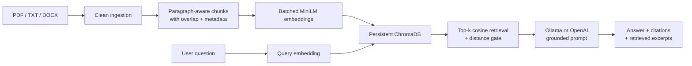

# Grounded Q&A Assistant Pro

A transparent retrieval-augmented generation (RAG) application that answers natural-language questions from a local collection of PDF and text documents. It builds a persistent semantic index, refuses questions unsupported by the retrieved evidence, and displays both inline citations and the exact source excerpts used for every answer.

## Features

- Ingests PDF, TXT, and DOCX files from `data/`
- Removes repeated PDF headers, footers, and page labels where possible
- Uses paragraph-aware chunks with overlapping context and source metadata
- Embeds every indexing batch with Sentence Transformers
- Persists cosine-search vectors in ChromaDB so querying does not re-index documents
- Supports local Ollama generation by default, with OpenAI and Google Gemini as optional providers
- Rejects low-relevance questions before calling the language model
- Provides one-shot and interactive command-line interfaces
- Includes five non-trivial documents (four TXT and one multi-page PDF)

## Tech stack

| Tool | Version | Purpose |
|---|---:|---|
| Python | 3.11+ | Application runtime |
| ChromaDB | 1.0.15 | Persistent vector database and cosine retrieval |
| Sentence Transformers | 5.0.0 | Batched local embeddings |
| all-MiniLM-L6-v2 | current model revision | 384-dimensional semantic embedding model |
| Ollama | current stable release | Local LLM serving (default) |
| OpenAI Python SDK | 1.97.0 | Optional hosted answer generation |
| pypdf | 5.8.0 | PDF extraction with page metadata |
| python-docx | 1.2.0 | Optional DOCX ingestion |
| requests | 2.32.4 | Ollama HTTP client |
| python-dotenv | 1.1.1 | Local environment configuration |
| pytest | 8.4.1 | Automated tests |

## Architecture



Indexing and querying are separate commands. `index` loads the knowledge base, chunks it, embeds all chunks in model batches, and replaces the disk-backed Chroma collection. `ask` and `chat` open that existing collection, embed only the question, retrieve the nearest chunks, apply a relevance threshold, and pass accepted evidence to the configured LLM.

### Chunking strategy

The project uses paragraph-aware fixed-size chunking. Paragraph boundaries are preserved whenever possible because they usually contain a complete idea; oversized paragraphs fall back to sentence boundaries. The default maximum is 1,200 characters with 180 characters of trailing overlap. This is large enough to retain an explanation while the overlap protects context that crosses a boundary. Each chunk stores the source filename, PDF page or document section, and its source-relative index.

### Embedding model and vector database

`sentence-transformers/all-MiniLM-L6-v2` was chosen because it is small enough for a laptop, runs without an API key, and provides strong general-purpose semantic retrieval. The complete chunk list is passed to one `encode` call with a batch size of 64; chunks are never embedded one at a time.

ChromaDB was selected because it supplies persistent local storage, metadata filtering support, and an HNSW cosine index with little operational overhead. The `.rag_index/` directory is excluded from Git because it is reproducibly built from committed documents.

## Project structure

```text
.
|-- data/                         # Five committed knowledge-base documents
|-- scripts/build_sample_pdf.py   # Rebuilds the included PDF source document
|-- source_documents/             # Editable source used to generate the PDF
|-- src/document_qa/
|   |-- ingestion.py              # PDF/TXT/DOCX loading and cleanup
|   |-- chunking.py               # Paragraph/sentence chunking and metadata
|   |-- embeddings.py             # Batched local embedding adapter
|   |-- vector_store.py           # Persistent Chroma operations
|   |-- generation.py             # Grounded Ollama/OpenAI prompts
|   |-- rag.py                    # Retrieval threshold and answer workflow
|   `-- cli.py                    # index, ask, and chat commands
`-- tests/                        # Unit tests with offline test doubles
```

## Setup

1. Clone the repository and enter it.

   ```bash
   git clone <your-public-repository-url>
   cd <repository-folder>
   ```

2. Create and activate a Python 3.11 virtual environment.

   ```bash
   python -m venv .venv
   # macOS/Linux
   source .venv/bin/activate
   # Windows PowerShell
   .venv\Scripts\Activate.ps1
   ```

3. Install the project.

   ```bash
   python -m pip install --upgrade pip
   pip install -e .
   ```

4. Copy the example environment configuration.

   ```bash
   # macOS/Linux
   cp .env.example .env
   # Windows PowerShell
   Copy-Item .env.example .env
   ```

5. Install [Ollama](https://ollama.com/), then download the default local model.

   ```bash
   ollama pull llama3.2:3b
   ```

6. Build the persistent index. The embedding model downloads once on the first run.

   ```bash
   document-qa index
   ```

7. Start an interactive session.

   ```bash
   document-qa chat
   ```

   A single question can be asked with:

   ```bash
   document-qa ask "Why is passivation important for orbital debris prevention?"
   ```

You can also replace `document-qa` with `python -m document_qa` in every command.

## Environment variables

| Variable | Required | Default | Description |
|---|---|---|---|
| `LLM_PROVIDER` | No | `ollama` | `ollama`, `openai`, or `gemini` |
| `OLLAMA_MODEL` | For Ollama | `llama3.2:3b` | Installed Ollama chat model |
| `OLLAMA_BASE_URL` | For Ollama | `http://localhost:11434` | Ollama server URL |
| `OPENAI_API_KEY` | For OpenAI | none | Secret API key; never commit it |
| `OPENAI_CHAT_MODEL` | For OpenAI | `gpt-4o-mini` | OpenAI chat model |
| `GEMINI_API_KEY` | For Gemini | none | Google AI Studio key; never commit it |
| `GEMINI_CHAT_MODEL` | For Gemini | `gemini-2.5-flash` | Gemini chat model |
| `EMBEDDING_MODEL` | No | `sentence-transformers/all-MiniLM-L6-v2` | Hugging Face model ID |
| `DATA_DIR` | No | `data` | Input document folder |
| `INDEX_DIR` | No | `.rag_index` | Persistent Chroma directory |
| `COLLECTION_NAME` | No | `document_qa` | Chroma collection name |
| `TOP_K` | No | `4` | Retrieved chunks per question |
| `MAX_DISTANCE` | No | `0.85` | Maximum accepted cosine distance |
| `CHUNK_SIZE` | No | `1200` | Maximum chunk characters |
| `CHUNK_OVERLAP` | No | `180` | Trailing context carried forward |
| `EMBEDDING_BATCH_SIZE` | No | `64` | Model batch size during encoding |

To use OpenAI or Gemini instead of Ollama, configure `LLM_PROVIDER=openai` or `LLM_PROVIDER=gemini` along with the appropriate API key (`OPENAI_API_KEY` or `GEMINI_API_KEY`) in `.env`. The same local embedding and retrieval pipeline is used.

## Example questions

1. **Why can warm nights make an urban heatwave more dangerous?** Expected theme: reduced physical recovery and compounding vulnerability.
2. **Why should seagrass projects address water quality before transplanting?** Expected theme: light, turbidity, nutrients, and avoiding repeated failure.
3. **What is a break-glass account and how should it be protected?** Expected theme: rare emergency access, strong controls, testing, and monitoring.
4. **How can training data leakage happen when records belong to the same person?** Expected theme: group-aware splitting and misleading validation.
5. **Why is passivation important at the end of a space mission?** Expected theme: safely removing stored energy to prevent later explosions.
6. **Who won yesterday's football match?** Expected behavior: the bot states that the indexed documents do not contain the answer.

## Tests

The unit suite does not download a model, start Ollama, or call a paid API.

```bash
pytest -q
```

It verifies metadata and overlap, batched indexing, distance-based refusal, evidence filtering, and source-labelled generation behavior.

## Recording checklist

For the required 3-8 minute demo: show the folder structure; delete `.rag_index/` if it exists; run `document-qa index`; start `document-qa chat`; ask the first five example questions plus the unanswerable sixth question; point out the citations and retrieved excerpts; and briefly explain the paragraph-aware overlap strategy. The recording must show live output. Add the final public repository URL and recording URL to the submission form rather than committing credentials or private links.

## Known limitations

- The first indexing run downloads the embedding model and may be slow on a CPU.
- Text extraction from scanned PDFs requires OCR, which is not included.
- Simple repeated-line cleanup cannot identify every unusual header or footer.
- Cosine distance is only a relevance proxy; `MAX_DISTANCE` may need tuning for a different domain.
- Small local LLMs may produce weaker prose or imperfect inline labels, though retrieved evidence is always displayed separately.
- The index is rebuilt as one collection; incremental file updates are not implemented.
- The CLI does not provide authentication or multi-user isolation.

## Security notes

`.env`, API keys, and the generated index are excluded from version control. Documents are sent only to the selected LLM provider during answer generation: Ollama keeps them local, while OpenAI mode sends retrieved excerpts to the configured hosted API. Review document sensitivity before choosing a provider.

